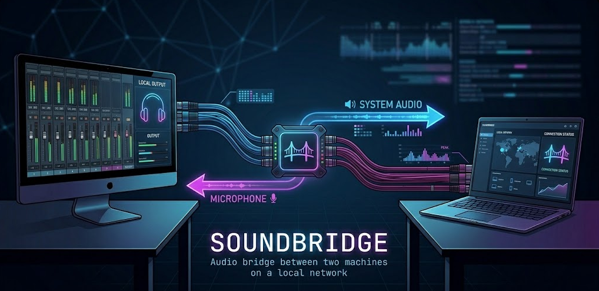

# SoundBridge



Audio bridge between machines on the same LAN via UDP. The server (Linux) captures system audio and sends it to the client (Windows), which plays it on headphones. The Windows microphone comes back as a virtual input device on Linux, available in apps like Discord, Google Meet, etc.

## Features

- **Opus codec** — compresses ~1920 bytes PCM to ~160 bytes Opus per frame, zero IP fragmentation
- **FEC + PLC** — Forward Error Correction and Packet Loss Concealment via libopus, smooth audio instead of clicks when packets are lost
- **Adaptive jitter buffer** — RFC 3550, automatically adjusts buffer depth based on network jitter
- **Sequence numbers** — gap detection to trigger PLC on lost frames
- **Virtual mic via pipe-source** — FIFO direct to PipeWire, minimal latency (~42ms buffer), Discord/Meet see it as a real microphone
- **Zero config** — automatic discovery via mDNS (zeroconf), no manual IPs
- **Heartbeat** — disconnect detection in 5s, automatic reconnection

## Architecture

```
Linux (Server)                              Windows (Client)
──────────────────────────────────────────────────────────────
System Audio (parec)                        Headphone Playback
        │ Opus encode                          ▲ Opus decode
        └──── UDP :4410 (stereo, 48kHz) ───────┘

Virtual Mic (pipe-source FIFO)              Mic Capture
        ▲ Opus decode                          │ Opus encode
        └──── UDP :4411 (mono, 48kHz) ─────────┘

mDNS (zeroconf)  ◄──── service discovery ──►  mDNS (zeroconf)
Heartbeat        ◄──── UDP :4413 ──────────►  Heartbeat
```

### Protocol

UDP packets with a 10-byte binary header:

```
| magic "SB" (2B) | type (1B) | channels (1B) | sample_rate (2B) | seq (2B) | payload_size (2B) | Opus data |
```

Packet types:
- `0x01` — system audio (stereo, Opus 128kbps)
- `0x02` — microphone audio (mono, Opus 64kbps)
- `0x03` — heartbeat (no payload)

### Connection flow

1. Server registers mDNS service `_soundbridge._udp.local.` and listens for heartbeats on port 4413
2. Client discovers the server via mDNS (zeroconf ServiceBrowser)
3. Client starts streaming and sends heartbeat to the server
4. Server receives the first heartbeat, identifies the client IP and starts streaming
5. If heartbeat fails (5s without response), disconnects and restarts discovery

## Requirements

- Python 3.12+
- [uv](https://docs.astral.sh/uv/) (package manager)
- **Linux**: `libopus0` and PipeWire (or PulseAudio)
- **Windows**: `opus.dll` (already bundled in the project)

```bash
# Linux — install libopus (probably already installed via PipeWire)
sudo apt install libopus0
```

## Installation

```bash
git clone https://github.com/AndersonFirmino/SoundBridge.git
cd SoundBridge
uv sync
```

## Network setup

Communication uses UDP on ports 4410-4413. Firewalls block them by default.

### Windows Firewall

```powershell
# PowerShell as administrator — allow ports
netsh advfirewall firewall add rule name="SoundBridge UDP In" dir=in action=allow protocol=UDP localport=4410-4413
netsh advfirewall firewall add rule name="SoundBridge UDP Out" dir=out action=allow protocol=UDP remoteport=4410-4413
```

### Linux Firewall

```bash
sudo iptables -I INPUT -p udp --dport 4410:4413 -j ACCEPT

# Make persistent (Debian/Ubuntu)
sudo apt install iptables-persistent
sudo netfilter-persistent save
```

## Usage

### Server (Linux)

```bash
# With GUI
uv run soundbridge server

# Without GUI
uv run soundbridge server --no-gui

# List audio devices
uv run soundbridge server --list-devices
```

### Client (Windows)

```powershell
# With GUI — double click soundbridge-client.bat
# Or via terminal:
uv run soundbridge client

# Without GUI
uv run soundbridge client --no-gui

# Connect directly to an IP (skip discovery)
uv run soundbridge client --ip 192.168.0.5
```

## Tests

```bash
uv run pytest -v tests/
```

```
tests/
├── conftest.py         # fixtures: PCM frames and byte payloads
├── test_opus.py        # roundtrip encode/decode, PLC, compression ratio
├── test_protocol.py    # 10-byte header, seq number, encode/decode
├── test_audio.py       # jitter buffer, prebuffering, devices, parec/pacat
├── test_network.py     # UDPSender, Discovery (zeroconf), heartbeat
└── test_state.py       # ConnectionState enum
```

## Project structure

```
soundbridge/
├── pyproject.toml          # dependencies and build config (uv + hatchling)
├── soundbridge/
│   ├── main.py             # Server, Client, CLI
│   ├── opus.py             # ctypes wrapper for libopus (encoder/decoder/PLC)
│   ├── audio.py            # Capture, Playback (jitter buffer), VirtualMicSource (pipe-source)
│   ├── network.py          # UDPSender, UDPReceiver, Discovery (zeroconf), Heartbeat
│   ├── protocol.py         # binary protocol encode/decode (10B header + seq)
│   ├── config.py           # constants (ports, sample rate, packet types)
│   ├── state.py            # ConnectionState enum
│   ├── gui.py              # CustomTkinter + system tray
│   └── opus.dll            # libopus 1.5.2 win-x64 (bundled)
└── tests/
```

## Configuration

| Constant | Value | Description |
|---|---|---|
| `SAMPLE_RATE` | 48000 | Hz |
| `FRAME_SIZE` | 480 | Samples per frame (10ms) |
| `CHANNELS_STEREO` | 2 | System audio |
| `CHANNELS_MONO` | 1 | Microphone |
| `AUDIO_PORT` | 4410 | UDP — system audio |
| `MIC_PORT` | 4411 | UDP — microphone |
| `HEARTBEAT_PORT` | 4413 | UDP — heartbeat |
| `HEARTBEAT_TIMEOUT` | 5.0s | Time without heartbeat = disconnect |

## Branches

- `main` — stable release
- `develop` — staging for next release
- `feature/*` — feature branches merged into develop

## License

MIT
